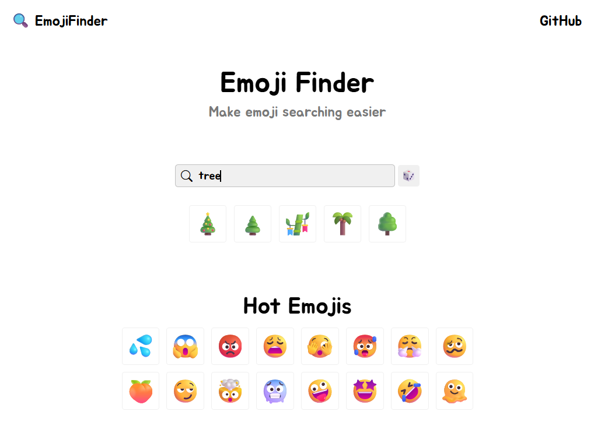

# EmojiFinder



# What is EmojiFinder?

EmojiFInder is a site that helps you find emoji by keywords.

# Quick Start

First, you need to clone the repository:

```
git clone https://github.com/sh4man4ik/Emoji-Finder.git
```

And go to the directory:

```
cd Emoji-Finder
```

Next, you download all the dependencies:

```
npm install
```

Next, run the frontend and backend commands (two individual terminals):

```
npm run dev
```

```
node server.js
```

# Technology

The frontend is written in **React** + **Vite**, the backend is written in **Node.js** + **express**. I also used
**Bootstrap**, **jQuery** and **Google Fonts**.

# How does it work?

The site sends an API request to emojis-world (https://github.com/abourtnik/emojis-world). I would like to point out
that the API has a **limit** on the number of requests, namely **500 per IP per day**.
